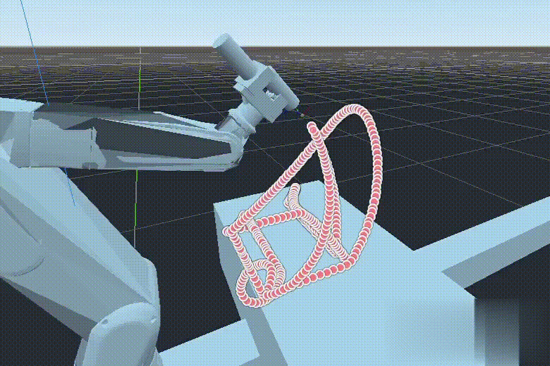
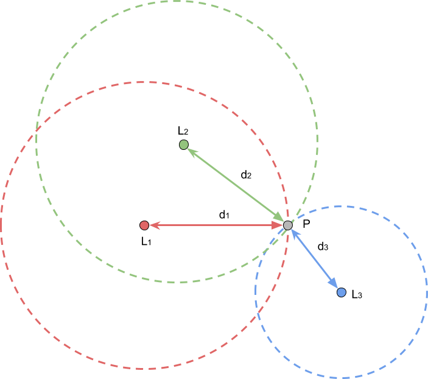
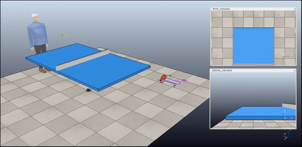
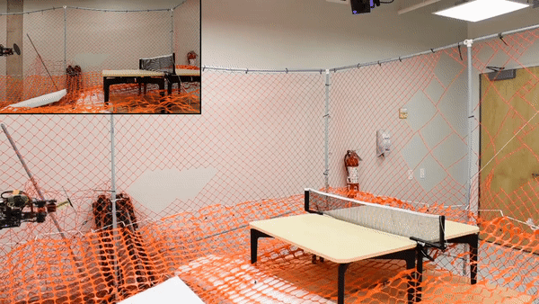
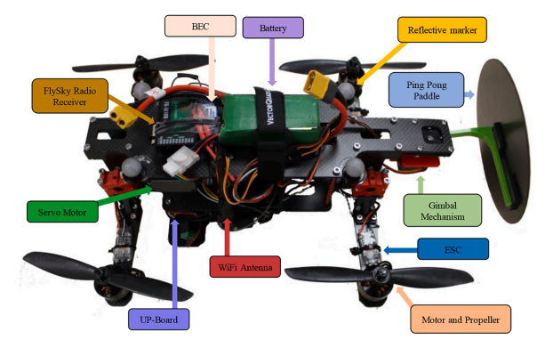
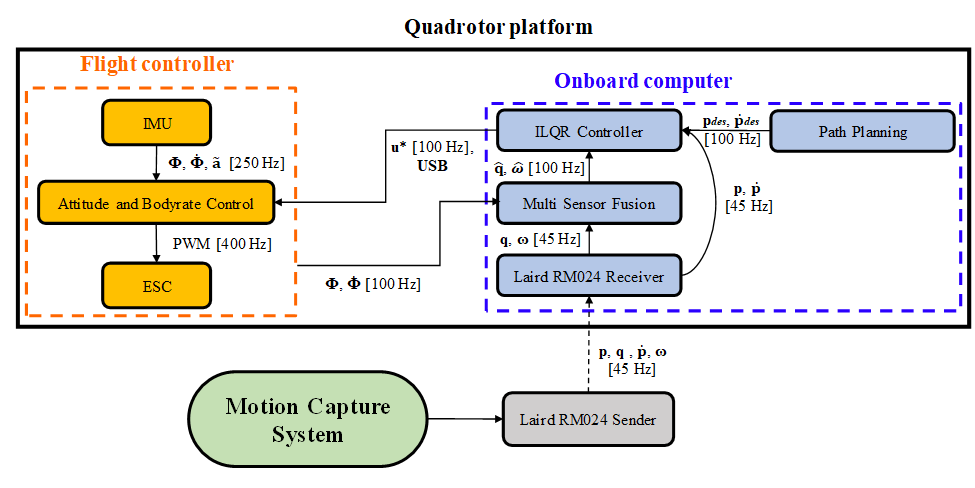
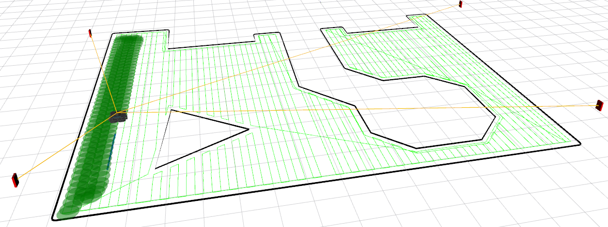
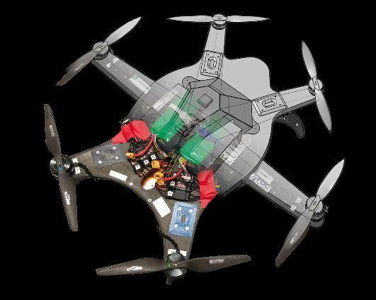

# About Me

Welcome to my porfolio page!

I am George, a robotics software engineer that hold a masters of applied science from [Polytechnic School of Montreal](https://www.polymtl.ca/en) graduated in 2020. 

I have 4 years of experience in the robotics field working with ground robots, aerial robots and manipulators.

I am skilled in C++, ROS, Python.

My main interest lies in developing autonomous robots applications by working on algorithms, sensors integration and infrastructure.

I follow SOLID principles to deliver production-grade software.

***

# Experience

## Making the future of vertical farming at [Seasony](https://www.seasony.io/)

I developed the networking library that enabled communication between a PC running ROS and an AVR based embedded controller responsible of sending commands to actuators and acquiring IMU data in real time.

This enabled manual teleoperation of the forklift system as shown in the video below.

&#11088; <strong>Main challenge: </strong> Design a modular networking library that supports TCP/UDP, CAN or Serial to send/receive data from sensors or actuators.

Skills: C++20, 
Boost, 
ROS2, 
Protobuf, 
Nanopb, 
FreeRTOS, 
Networking

## Changing the manufacturing industry with autonomous industrial robots for painting, powder coating, welding, sanding and milling at [Omnirobotic](https://omnirobotic.com/)

As part of the motion planning team, I developed a driver to send joint commands to a FANUC robot over Ethernet. 

I enabled the use of collaborative robots by developing a maximum speed and acceleration trajectory planner based on polynomials.

I also worked on reducing the toolpath planning time by benchmarking different sampling-based algorithms from OMPL on custom scenarios.

Finally, I worked on developing a deployment application that loads binaries from our servers and deploys them on customers computers as docker containers. 

&#11088; <strong>Main challenge: </strong> Reduce motion planning time for a wide range of scenarios.

Skills: C++11, 
Boost, 
OMPL, 
Protobuf, 
Docker, 
OMPL, 
CI/CD, 
Python, 
Nomad, 
Pytest, 
Optimization, 
Networking

## Transform the healthcare infrastructure at [Humanitas](https://www.humanitas.io/)

I worked on a ground robot that was responsible of delivering goods in a hospital.

My main task was to develop a localization solution using UWB (ultra-wide band) sensors (DW1000) as beacons and a trilateration algorithm to locate the robot indoors.

Compared to Wifi signals, UWBs sensors can improve localization precision but they need an unobstructed line of sight. I used the serial port to receive the distance reported by the sensors into a Raspberry Pi 4 and stream it over Wifi to the main computer on the robot.

I also design the robotic system by chosing sensors such as sonars, wheels encoder and radar for improved localization and obstacle avoidance. I integrated them in with [ROS Navigation Stack](https://github.com/ros-planning/navigation).

Furthermore, I used PX4 as a microcontroller to actuate the wheels. This required modifying the PX4 firmware to support my type of steering system for manual teleoperation with a joystick.

&#11088; <strong>Main challenge: </strong> Emulate an UWB sensor for testing.

Skills: C++14, 
Embedded, 
ROS, 
Nav, 
Python, 
PX4, 
Serial, 
Raspberry Pi

## Changing people's lifes at the Intelligent Systems and Mechatronics Lab

To help rehabilitate people, I developed an autonomous drone that can play ping pong with them. 

Here is what the drone looked like:

I designed this robotic system from scratch during my master's degree, choosing the components, designing the 3D printed parts and coding the algorithms required to play ping pong autonomously.

The architecture was composed of an inner loop responsible of attitude control of the drone at a higher rate and a trajectory tracking controller running on an onboard computer responsible of feeding the angular rate to the aforementioned attitude controller. 

The main innovations here were the tilting arm mechanism for fast pitch response time and the iLQR controller that enables aggressive trajectory tracking with its predictive capability.

I used ROS to stream the IMU data from a PX4 flight controller, run the iLQR controller in a node and send back attitude commands via Mavlink to the PX4. 

I learned how to setup a realistic simulation in Gazebo including the estimation of drag coefficient of the ping pong ball the bouncing coefficients. 

I also experimented with different controllers such as PID, LQR and MCP until I found one that achieved the required performance.

Furthermore, to find the right trajectory to follow by the controller, a minimum snap trajectory planner was implemented with contraints on the estimated hitting 3D position of the ping pong ball.

&#11088; <strong>Main challenge: </strong> Achieve aggressive trajectory tracking with a drone precisely enough to hit a ping pong ball in flight.

The paper "[Design and development of a novel type of table tennis aerial robot player with tilting propellers](https://www.sciencedirect.com/science/article/pii/S0957415821000015)" was published about the project.

Skills: C++11, 
ROS, 
Python, 
PX4, 
Mavlink, 
Optimization, 
Controllers

*** 

# Projects

## Autonomous Lawn Mower Robot

I developed an autonomous lawn mower robot that uses UWBs sensors for localization.

I used an open source boustrophedon path planner to achieve full surface coverage.

Also, I developed a differential drive controller for a differential wheel robot. 

The robot was built from scratch with low cost components as a proof of concept.

&#11088; <strong>Main challenge: </strong> Achieve good trajectory tracking accuracy with low cost material.

Skills: C++11, 
ROS, 
Python, 
UWB, 
Optimization, 
Controllers

## Self-balancing robot

I developed a self-balacing robot using stepper motors and a Raspberry Pi. 

I choose the components, 3D printed the parts and soldered the electrical components such as the motor controller.

&#11088; <strong>Main challenge: </strong> Tune a controller for low frequency adujstment of a self-balacing robot.

Skills: Python, 
Python, 
Linux, 
Controllers

## Autonomous solar panel monitoring with an aerial robot

I was a member of Elikos, a student club dedicated to the development of autonomous unmanned aerial vehicles to participate at the Unmanned Systems Canada Student UAS Competition.

The goal of the competition was to monitor a solar panel farm.

I was responsible of telecommunications and flight tests.

&#11088; <strong>Main challenge: </strong> Achieve reliable telecommunication at long ranges.

Skills: PX4, 
Linux, 
Telecommunications

***

# Education

### Master of Applied Sciences: Mechanical Engineering
- Graduated in 2020
- Polytechnic School of Montreal
- GPA 4/4

### Bachelor's Degree: Aerospace Engineering
- Graduated in 2018
- Polytechnic School of Montreal
- GPA 3.89/4

***

# Hobbies

I like being active and thus enjoy
- bodybuilding
- hiking
- cycling

Here is a picture of me on top of Gingilos moutain, Crete, Greece in 2024.

