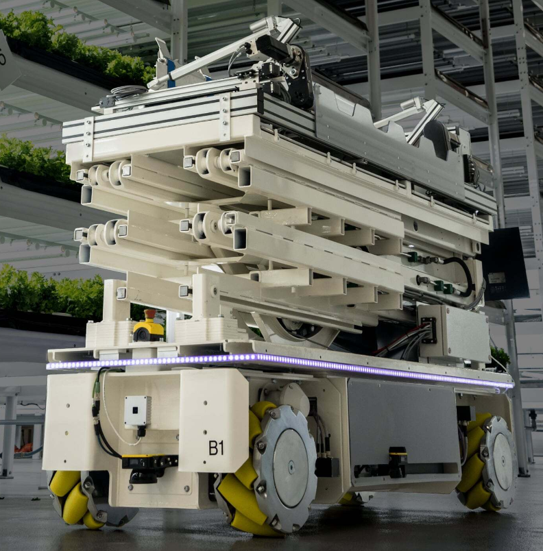

# About Me

Welcome to my porfolio page!

I am George, a robotics software engineer that hold a masters of applied science from [Polytechnic School of Montreal](https://www.polymtl.ca/en) graduated in 2020. 

I have 4 years of experience in the robotics field working with ground robots, aerial robots and manipulators.

I am skilled in C++, ROS, Python.

My main interest lies in developing autonomous robots applications by working on algorithms, sensors integration and infrastructure.

I follow SOLID principles to deliver production-grade software.

***

# Experience

## Making the future of vertical farming at [Seasony](https://www.seasony.io/)

I developed the networking library that enabled communication between a PC running ROS and an AVR based embedded controller responsible of sending commands to actuators and acquiring IMU data in real time.

This enabled manual teleoperation of the forklift system as shown in the video below.

Skills: C++20, 
Boost, 
ROS2, 
Protofub, 
Nanopb, 
FreeRTOS, 
Networking

# Projects

# Education

# Hobbies

